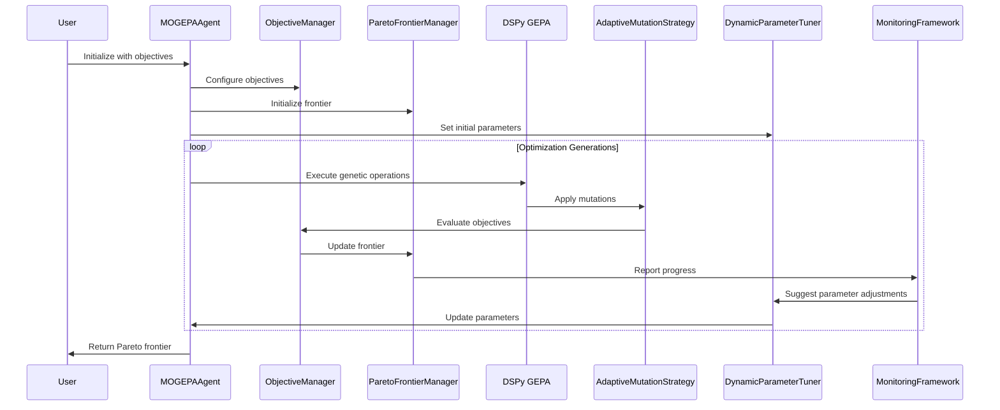

# Multi-Objective Optimization Framework for DSPy GEPA

## Executive Summary

This document outlines the architectural design for a comprehensive multi-objective optimization framework that extends the existing DSPy GEPA integration. The system addresses key limitations of the current single-objective implementation by introducing Pareto frontier management, advanced mutation strategies, dynamic parameter tuning, and sophisticated monitoring capabilities.

## Architecture Overview

### Core Design Principles

1. **Extensibility**: Built upon the official DSPy GEPA wrapper for seamless ecosystem integration
2. **Modularity**: Separation of concerns with pluggable components for metrics, mutations, and monitoring
3. **Scalability**: Designed to handle complex optimization scenarios with multiple competing objectives
4. **Adaptability**: Dynamic parameter adjustment based on optimization state and convergence analysis

### High-Level System Architecture

```mermaid
graph TB
    subgraph "Multi-Objective GEPA Framework"
        MOG[MOGEPAAgent] --> OM[ObjectiveManager]
        MOG --> PF[ParetoFrontierManager]
        MOG --> AMS[AdaptiveMutationStrategy]
        MOG --> DPT[DynamicParameterTuner]
        MOG --> MF[MonitoringFramework]
        
        subgraph "Objective System"
            OM --> TM[TaskMetrics]
            OM --> RM[ResourceMetrics]
            TM --> AM[AccuracyMetric]
            TM --> FM[FluencyMetric]
            TM --> RM2[RelevanceMetric]
            RM --> TU[TokenUsageMetric]
            RM --> ET[ExecutionTimeMetric]
        end
        
        subgraph "Genetic Operations"
            AMS --> SM[SemanticMutator]
            AMS --> TSM[TaskSpecificMutator]
            AMS --> ARM[AdaptiveRateMutator]
        end
        
        subgraph "DSPy Integration"
            MOG --> DI[DSPyIntegrationLayer]
            DI --> MC[MetricConverter]
            DI --> SA[SignatureAnalyzer]
        end
        
        subgraph "Monitoring & Analysis"
            MF --> CD[ConvergenceDetector]
            MF --> PFV[ParetoFrontierVisualizer]
            MF --> OSE[OptimalStoppingEstimator]
        end
    end
    
    subgraph "Existing DSPy GEPA"
        DGEPA[Official DSPy GEPA]
        MOG --> DGEPA
    end
    
    subgraph "External Systems"
        LLM[Language Models]
        EVAL[Evaluation Framework]
        MOG --> LLM
        MOG --> EVAL
    end
```



## Core Architecture Components

### 1. MOGEPAAgent (Multi-Objective GEPA Agent)

**Purpose**: Main orchestration class that extends the existing `GEPAAgent` with multi-objective capabilities.

**Key Responsibilities**:
- Coordinate multi-objective optimization process
- Manage Pareto frontier evolution
- Interface with DSPy GEPA for genetic operations
- Aggregate and analyze optimization results

**Core Methods**:
```python
class MOGEPAAgent(GEPAAgent):
    def __init__(self, objectives: List[Objective], **kwargs)
    def optimize(self, program, trainset, **kwargs) -> MultiObjOptimizationResult
    def get_pareto_frontier(self) -> ParetoFrontier
    def select_optimal_solution(self, preference: Optional[PreferenceVector] = None)
```

### 2. Objective System

#### 2.1 ObjectiveManager

**Purpose**: Manages multiple optimization objectives and their evaluation.

**Core Classes**:
```python
class Objective:
    name: str
    weight: float
    direction: OptimizationDirection  # MINIMIZE, MAXIMIZE
    evaluator: Callable[[Any, Any], float]

class TaskMetrics:
    accuracy_metric: AccuracyMetric
    fluency_metric: FluencyMetric
    relevance_metric: RelevanceMetric

class ResourceMetrics:
    token_usage_metric: TokenUsageMetric
    execution_time_metric: ExecutionTimeMetric
```

#### 2.2 Task-Specific Metrics

**AccuracyMetric**: Evaluates task performance based on ground truth comparison
- Supports various task types: classification, generation, translation
- Configurable for different domains (code, text, structured data)

**FluencyMetric**: Assesses output quality and linguistic coherence
- Language model-based fluency scoring
- Task-specific fluency criteria

**RelevanceMetric**: Measures output relevance to input and context
- Semantic similarity analysis
- Context-aware relevance scoring

#### 2.3 Resource Metrics

**TokenUsageMetric**: Tracks API costs and model efficiency
- Input/output token counting
- Cost estimation based on provider pricing

**ExecutionTimeMetric**: Monitors latency and throughput
- End-to-end execution time
- Parallel execution efficiency

### 3. Pareto Frontier Management

#### 3.1 ParetoFrontierManager

**Purpose**: Maintains and evolves the Pareto frontier of non-dominated solutions.

**Core Operations**:
- Pareto dominance checking
- Frontier updates and pruning
- Diversity maintenance
- Solution ranking and selection

**Key Methods**:
```python
class ParetoFrontierManager:
    def update_frontier(self, candidate: CandidateSolution) -> bool
    def get_non_dominated_solutions(self) -> List[CandidateSolution]
    def prune_by_diversity(self, max_size: int)
    def select_solution(self, preference: PreferenceVector) -> CandidateSolution
```

#### 3.2 CandidateSolution

**Purpose**: Represents a solution with its multi-objective evaluation.

```python
@dataclass
class CandidateSolution:
    program: Any
    objectives: Dict[str, float]
    generation: int
    parent_solutions: List[str]
    metadata: Dict[str, Any]
    
    def dominates(self, other: 'CandidateSolution') -> bool
    def crowding_distance(self, frontier: 'ParetoFrontier') -> float
```

### 4. Advanced Mutation Strategies

#### 4.1 AdaptiveMutationStrategy

**Purpose**: Dynamically adapts mutation operations based on optimization state.

**Core Components**:
- Semantic-aware mutation operators
- Task-specific mutation patterns
- Adaptive rate adjustment
- Diversity preservation mechanisms

#### 4.2 SemanticMutator

**Purpose**: Performs semantically meaningful prompt transformations.

**Mutation Operations**:
- Paraphrasing while preserving intent
- Style and tone adjustments
- Domain-specific terminology substitution
- Instruction clarity enhancement

#### 4.3 TaskSpecificMutator

**Purpose**: Applies domain-aware mutations based on task type.

**Task-Aware Mutations**:
- **Translation**: Language pair adjustments, formality level changes
- **Code Generation**: Algorithm selection, language-specific patterns
- **Summarization**: Length constraints, focus area modifications
- **Question Answering**: Answer format requirements, source reference styles

#### 4.4 AdaptiveRateMutator

**Purpose**: Dynamically adjusts mutation rates based on optimization progress.

**Adaptation Strategies**:
- Convergence-based rate adjustment
- Diversity-driven mutation intensity
- Performance feedback loops
- Resource-aware rate modulation

### 5. Dynamic Parameter Tuning

#### 5.1 DynamicParameterTuner

**Purpose**: Automatically adjusts genetic algorithm parameters during optimization.

**Tunable Parameters**:
- Population size
- Mutation rates
- Crossover probabilities
- Selection pressure
- Elitism ratios

**Adaptation Mechanisms**:
```python
class DynamicParameterTuner:
    def adjust_population_size(self, convergence_metrics: Dict[str, float])
    def tune_mutation_rates(self, diversity_metrics: Dict[str, float])
    def optimize_crossover_probability(self, generation: int, performance_history: List[float])
    def adapt_elitism_ratio(self, frontier_quality: float)
```

#### 5.2 ConvergenceAnalyzer

**Purpose**: Monitors optimization progress and detects convergence patterns.

**Convergence Metrics**:
- Hypervolume change
- Pareto frontier stability
- Solution diversity metrics
- Objective improvement rates

### 6. DSPy Integration Layer

#### 6.1 DSPyIntegrationLayer

**Purpose**: Bridges the multi-objective framework with DSPy's optimization ecosystem.

**Core Responsibilities**:
- DSPy signature analysis
- Metric conversion between DSPy and GEPA formats
- Module compatibility checking
- Optimization result mapping

#### 6.2 MetricConverter

**Purpose**: Transforms DSPy metrics to multi-objective framework format.

**Conversion Operations**:
```python
class MetricConverter:
    def dspy_to_multi_obj(self, dspy_metric: Callable, objective_type: ObjectiveType) -> Objective
    def aggregate_dspy_metrics(self, metrics: List[Callable], weights: List[float]) -> Objective
    def create_composite_metric(self, task_metrics: Dict[str, Callable]) -> List[Objective]
```

#### 6.3 SignatureAnalyzer

**Purpose**: Analyzes DSPy module signatures for constraint-aware optimization.

**Analysis Capabilities**:
- Input/output type inference
- Constraint extraction
- Compatibility validation
- Optimization boundary detection

### 7. Monitoring and Analysis Framework

#### 7.1 MonitoringFramework

**Purpose**: Provides comprehensive monitoring and analysis of optimization progress.

**Core Components**:
- Real-time performance tracking
- Convergence detection
- Resource utilization monitoring
- Quality assurance metrics

#### 7.2 ConvergenceDetector

**Purpose**: Identifies optimization convergence and stopping points.

**Detection Methods**:
- Pareto frontier stability analysis
- Hypervolume convergence testing
- Solution diversity monitoring
- Improvement plateau detection

#### 7.3 ParetoFrontierVisualizer

**Purpose**: Provides visualization of multi-objective optimization results.

**Visualization Types**:
- 2D/3D Pareto frontier plots
- Parallel coordinate plots
- Radar charts for objective trade-offs
- Heat maps for solution distributions

#### 7.4 OptimalStoppingEstimator

**Purpose**: Predicts optimal stopping points for optimization.

**Estimation Strategies**:
- Machine learning-based prediction
- Statistical trend analysis
- Resource-bounded optimization
- Diminishing returns analysis

## Data Flow Architecture

### Optimization Process Flow



### Data Structures

#### Multi-Objective Optimization Result

```python
@dataclass
class MultiObjOptimizationResult:
    pareto_frontier: ParetoFrontier
    optimization_history: List[OptimizationSnapshot]
    convergence_metrics: ConvergenceMetrics
    resource_usage: ResourceUsageReport
    parameter_evolution: ParameterEvolutionHistory
    recommendations: OptimizationRecommendations
    
    def get_best_solution(self, objective: str) -> CandidateSolution
    def get_balanced_solution(self) -> CandidateSolution
    def export_analysis_report(self) -> Dict[str, Any]
```

#### Optimization Snapshot

```python
@dataclass
class OptimizationSnapshot:
    generation: int
    pareto_frontier: ParetoFrontier
    hypervolume: float
    diversity_metrics: Dict[str, float]
    convergence_indicators: Dict[str, bool]
    parameter_state: ParameterState
    resource_consumption: ResourceMetrics
```

## Integration Patterns

### 1. DSPy Module Optimization

```python
# Example usage for DSPy module optimization
from dspy_gepa.multi_objective import MOGEPAAgent, TaskMetrics, ResourceMetrics

# Define objectives
objectives = [
    TaskMetrics.accuracy_metric(weight=0.4),
    TaskMetrics.fluency_metric(weight=0.2),
    TaskMetrics.relevance_metric(weight=0.2),
    ResourceMetrics.token_usage_metric(weight=0.1, direction="MINIMIZE"),
    ResourceMetrics.execution_time_metric(weight=0.1, direction="MINIMIZE")
]

# Create multi-objective agent
agent = MOGEPAAgent(
    objectives=objectives,
    max_metric_calls=200,
    max_generations=30
)

# Optimize DSPy module
result = agent.optimize(program, trainset)

# Get optimal solutions based on preferences
balanced_solution = result.get_balanced_solution()
resource_optimal = result.get_best_solution("token_usage")
performance_optimal = result.get_best_solution("accuracy")
```

### 2. Preference-Based Solution Selection

```python
# Define solution preferences
preferences = PreferenceVector({
    "accuracy": 0.5,
    "fluency": 0.2,
    "relevance": 0.2,
    "token_usage": -0.1,  # Negative indicates minimization
    "execution_time": -0.1
})

# Select solution based on preferences
optimal_solution = agent.get_pareto_frontier().select_solution(preferences)
```

## Configuration and Customization

### 1. Objective Configuration

```python
# Custom objective definition
class CustomMetric(Objective):
    def __init__(self, name: str, evaluator: Callable, weight: float = 1.0):
        super().__init__(name, weight, OptimizationDirection.MAXIMIZE)
        self.evaluator = evaluator
    
    def evaluate(self, program: Any, dataset: List[Any]) -> float:
        return self.evaluator(program, dataset)

# Register custom objective
agent.register_objective(CustomMetric("custom_metric", my_evaluator, 0.3))
```

### 2. Mutation Strategy Customization

```python
# Custom mutation operator
class CustomMutator(MutationOperator):
    def mutate(self, solution: CandidateSolution) -> CandidateSolution:
        # Custom mutation logic
        return mutated_solution

# Register custom mutator
agent.register_mutator(CustomMutator(), weight=0.2)
```

### 3. Stopping Criteria Configuration

```python
# Advanced stopping criteria
stopping_criteria = StoppingCriteria(
    max_generations=50,
    max_metric_calls=500,
    convergence_threshold=0.001,
    min_improvement_rate=0.01,
    max_time_seconds=3600,
    resource_limits={
        "max_tokens": 1000000,
        "max_cost": 100.0
    }
)

agent.configure_stopping_criteria(stopping_criteria)
```

## Performance and Scalability Considerations

### 1. Parallel Evaluation

- Multi-threaded objective evaluation
- Batch processing for efficiency
- Distributed evaluation support
- Resource pooling and management

### 2. Memory Management

- Efficient frontier storage
- Solution caching mechanisms
- Memory usage monitoring
- Garbage collection optimization

### 3. Optimization Efficiency

- Early stopping for dominated solutions
- Incremental frontier updates
- Lazy evaluation strategies
- Resource-aware optimization

## Production Readiness Features

### 1. Monitoring and Alerting

- Real-time optimization tracking
- Performance anomaly detection
- Resource usage alerts
- Automatic failover mechanisms

### 2. Persistence and Recovery

- Optimization state checkpointing
- Frontier persistence
- Recovery from interruptions
- History management

### 3. API and Integration

- RESTful API interface
- WebSocket real-time updates
- Batch processing support
- Workflow integration capabilities

## Future Extensions

### 1. Machine Learning Integration

- Learned mutation strategies
- Performance prediction models
- Automated objective discovery
- Adaptive weight learning

### 2. Advanced Optimization Techniques

- Decomposition-based multi-objective optimization
- Interactive preference learning
- Constraint handling mechanisms
- Dynamic objective addition/removal

### 3. Distributed Optimization

- Multi-agent optimization
- Federated learning support
- Cloud-native deployment
- Edge optimization capabilities

## Conclusion

The proposed multi-objective optimization framework provides a comprehensive, extensible, and production-ready solution for advanced prompt engineering in the DSPy ecosystem. By building upon the official DSPy GEPA integration, the system ensures compatibility while introducing powerful multi-objective optimization capabilities that address the complex trade-offs inherent in modern language model applications.

The modular architecture allows for easy customization and extension, while the sophisticated monitoring and analysis frameworks provide the visibility and control needed for production deployments. The system is designed to scale from simple single-objective optimizations to complex multi-objective scenarios with dozens of competing objectives.